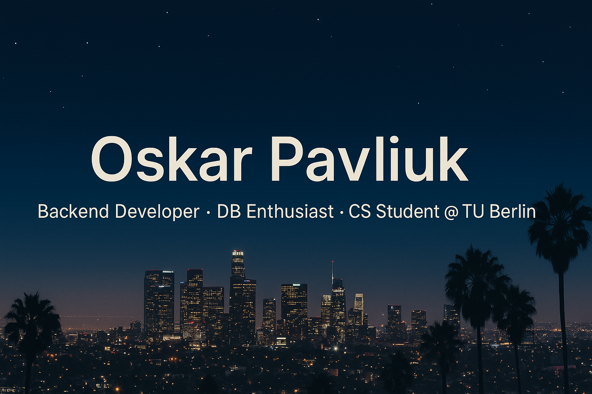

  

# 👋 Welcome to my GitHub profile!

My name is **Oskar Pavliuk** — I’m a graduate of 🎓 **Igor Sikorsky Kyiv Polytechnic Institute**  
(major: *Information Systems and Technologies*)  
and currently a **4th semester (2nd year)** 🧑‍💻 student at **Technische Universität Berlin**  
(major: *Computer Science*).

---

## 💡 About Me

I'm passionate about working with **databases**, building robust and scalable **backend systems**,  
and crafting **modern, high-performance web applications** with a focus on clean architecture and great user experience. 🚀  
I enjoy learning new technologies and applying them to create real-world solutions.

---

## 🛠️ Technical Skills

### 💻 Programming Languages  
- **Java (Spring)** ☕  
- **Python** 🐍  
- **Haskell** λ  
- **Prolog** 🤖  
- **Matlab** 📊  
- **C** ⚙️  
- **SQL (PostgreSQL)** 🐘

### 🧰 Tools & Practices  
- **Git**, **GitHub** 🔧  
- **IDEs**: IntelliJ IDEA, Rider, PyCharm, CLion, DataGrip, PopSQL 💻  
- **Unit Testing** ✅  
- **CI/CD Basics** ⚙️  
- **Docker**, **Docker Compose**, **Docker Swarm** 🐳

---

📄 [Click here to view my Resume (PDF)](./resume.pdf)

---

